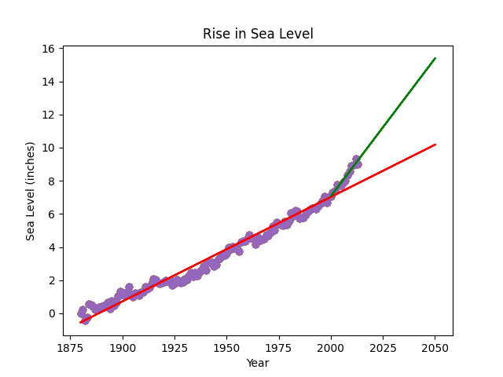

### Sea Level Predictor 🌊📈

### My Final Project for the freeCodeCamp Data Analysis with Python Certification

This project marks the end of my journey to earn the Data Analysis with Python Certification from freeCodeCamp! It was a rewarding finale that brought together everything I’ve learned about data manipulation, statistical analysis, and visualization.

### Project Purpose
The goal of this project was to analyze a dataset of global average sea level changes since 1880 and use that data to predict future sea level rises through the year 2050. By using linear regression, I modeled how the rate of sea level rise has accelerated recently.

### Final VisualizationThe Learning Process:
1. Step-by-StepData Exploration: Loaded the epa-sea-level.csv using Pandas and created a scatter plot.Long-Term Trend: Used scipy.stats.linregress to find the slope and intercept for the 1880–2013 data and projected it to 2050.

2. Recent Trend: Filtered the data for years $\ge 2000$ and ran a second regression to show the increased rate of rise.
Final Plot: I used Matplotlib to layer the data and predictions with required labels and titles.

### How to Use This Code:
1. Clone the Repository:Bashgit clone https://github.com/YOUR_USERNAME/sea-level-predictor.git
2. Install Requirements: Ensure you have pandas, matplotlib, and scipy installed.
3. Run the Analysis: 'python main.py' in your terminal
This will run the unit tests and update the sea_level_plot.png file.

